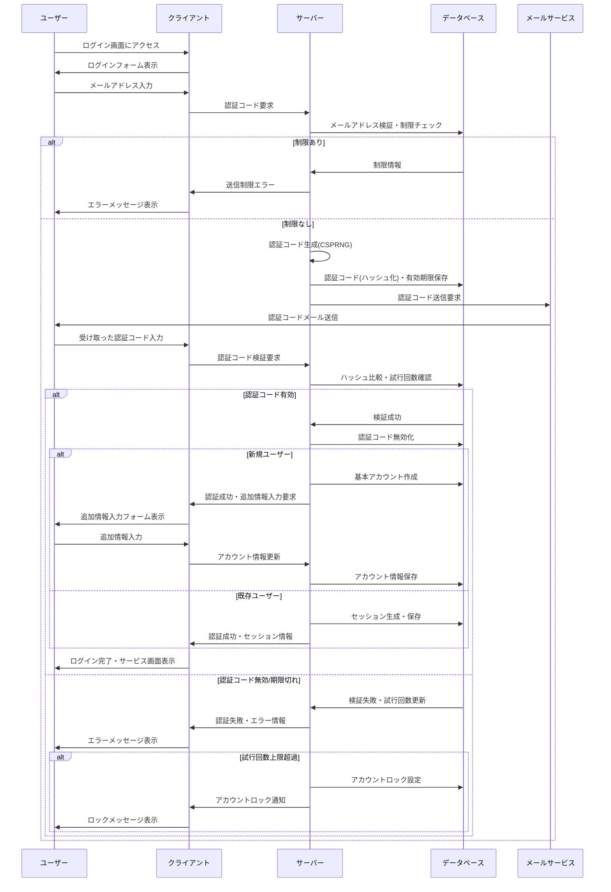

# Hono x Auth.js sample

- Hono
- Auth.js
- drizzle-orm
- shadcn/ui


Ref:
- https://github.com/honojs/middleware/tree/main/packages/react-renderer
- https://ui.shadcn.com/docs/installation/vite
- https://github.com/kfly8-sandbox/sample-hono-shadcnui

## 基本仕様

- ユーザー認証は、メールアドレスと認証コードを用いる
- 認証コードの検証は、メールを利用する
- 認証コードの検証が出来た時、
  - ユーザーが未登録なら基本アカウントが作成され、追加情報入力画面に遷移する
  - 既存ユーザーの場合は、セッションが作成されてログイン状態となる
- 認証コードは、6桁の数字
- 認証コードの有効期限は、30分

## セキュリティ対策

- 認証コードは平文で保存せず、bcryptでハッシュ化して保存する
- 認証コードは暗号論的に安全な乱数生成器(CSPRNG)を使用して生成する
- 認証コードの検証に5回失敗したら、対象メールアドレスを10分間ロックする
- 一度使用されたコードは即時無効化する
- 同一メールアドレスへの認証コード送信は5分間に3回までに制限する
- セッションは2週間有効とし、アクティビティがある場合は自動更新する

## ユーザーエクスペリエンス

- 再送信機能: 認証コードが届かない・期限切れの場合に、ユーザーは認証コードを再送信できる（上記の制限内で）
- 入力欄は、数値６桁であることが明確にわかるデザインとし、ペーストすると６桁すべて入力される
- ユーザー登録フロー:
    1. メールアドレス入力
    2. 認証コード検証
    3. 初回ログインの場合、ユーザー名などの追加情報入力画面に遷移
    4. 既存ユーザーの場合、直接ダッシュボードに遷移

## メール

テキストメールで次のようなメールを送る

```txt
件名: 【example】認証コードのお知らせ

認証コード: 123456

この認証コードをexampleの画面で入力してください。
認証コードの有効期限は、30分間です。

※この認証コードを他人に共有しないでください
※このお知らせに心当たりがない場合、このメールを破棄してください

ご不明点がある場合、下記サポートページをご確認ください
https://support.example
```

## エラーハンドリング

- コード無効: 「認証コードが無効です。再度お試しください（残り試行回数: X回）」
- 期限切れ: 「認証コードの有効期限が切れています。新しいコードを送信しますか？」
- 送信エラー: 「メールの送信に失敗しました。しばらく経ってから再度お試しください」
- 送信制限: 「短時間に複数回リクエストされました。○分後に再度お試しください」
- ロック状態: 「セキュリティのため、このアカウントは一時的にロックされています。○分後に再度お試しください」
- システムエラー: 「システムエラーが発生しました。しばらく経ってから再度お試しいただくか、サポートにお問い合わせください」

## セッション管理

- JWT + HTTPOnly Cookie でセッション管理を実装
- JWTの構成:
  - ペイロード: ユーザーID、発行時間、有効期限、セッション識別子
  - 署名: サーバーサイドの秘密鍵で署名
- セッションの有効期限: 2週間
- リフレッシュ戦略: 有効期限の半分を経過した時点で自動的に新しいJWTを発行
- セキュリティ対策:
  - HTTPOnly属性: JavaScriptからのアクセスを防止
  - Secure属性: HTTPS接続のみでCookieを送信
  - SameSite=Lax属性: CSRF攻撃からの保護
- ログアウト処理: 
  - クライアント側でCookieを削除
  - 必要に応じてブラックリスト機能の実装（高セキュリティが必要な場合）
- マルチデバイス対応: デバイスごとに個別のJWTを発行

## シーケンス図


